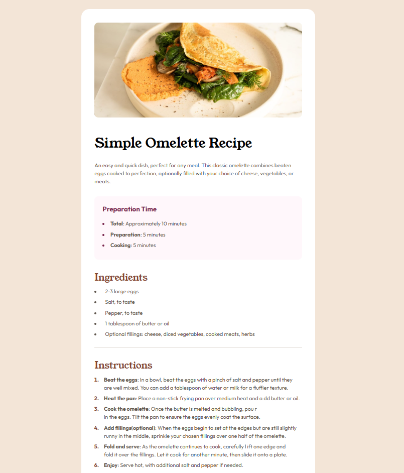

# Frontend Mentor - Recipe page solution

This is a solution to the [Recipe page challenge on Frontend Mentor](https://www.frontendmentor.io/challenges/recipe-page-KiTsR8QQKm). Frontend Mentor challenges help you improve your coding skills by building realistic projects.

## Table of contents

- [Overview](#overview)
  - [The challenge](#the-challenge)
  - [Screenshot](#screenshot)
  - [Links](#links)
- [My process](#my-process)
  - [Built with](#built-with)
  - [What I learned](#what-i-learned)
  - [Continued development](#continued-development)
  - [Useful resources](#useful-resources)
- [Author](#author)
- [Acknowledgments](#acknowledgments)

**Note: Delete this note and update the table of contents based on what sections you keep.**

## Overview

This is the 4th Frontend Mentor challenge in the 'newbie' section. It's a simple responsive recipe page.

### Screenshot



### Links

- Solution URL: [View Repo](https://github.com/christencodes/Recipe-Page)
- Live Site URL: [View Live Site](https://christenally.github.io/Recipe-Page)

## My process

### Built with

- Semantic HTML5 markup
- CSS custom properties
- Flexbox

### What I learned

This project was a bit of challenge because I was being a perfectionist. The major hurdle I face was when making the site for the smallest screen size. Unfortunately, the indenting on the `li` text content was not behaving properly. Fortunately, after some reviewing I realized I could use ::before and ::after. I displayed the li as flex, which removed the list-style, but I was able to insert the bullet with unicode. Here's a snippet:

```css
.ingredients ul li {
  display: flex;
  align-items: center;
}

.ingredients ul li::before {
  content: "•";
  font-size: 25px;
  color: var(--brown-800);
  margin-right: 12px;
}
```

### Continued development

1. I want to focus on using semantic html and structuring my code better so it's readable to others
2. I wrote a lot of CSS this time around, but I felt like I was rewriting code over and over. I want to address this in my next project

**Note: Delete this note and the content within this section and replace with your own plans for continued development.**

### Useful resources

- [Google!](https://www.google.com) - in Google we trust...

## Author


- Frontend Mentor - [@Christenally](https://www.frontendmentor.io/profile/Christenally)


## Acknowledgments

I would like to thank myself fo rbeing patient with myself.
